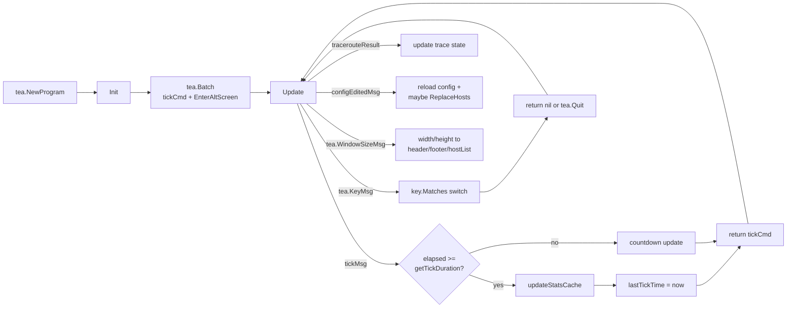

# AGENTS_TUI.md — TUI-specific rules

This file extends [`AGENTS.md`](./AGENTS.md) with rules specific to the
bubbletea-based TUI. Read `AGENTS.md` first; this document assumes it.

The TUI code lives in:

| File | Role |
|---|---|
| `tui.go` | `TUIModel`, lifecycle, `Update`, `View` |
| `tui_list.go` | List rendering, filter, sort, subnet grouping |
| `tui_components.go` | `HeaderModel`, `FooterModel`, `HostListModel` |
| `tui_utils.go` | Cycle helpers, `cloneHiddenHosts`, `ipKey`, `parseHostsInput` |
| `config_editor_smidgen.go` | Embedded `e` editor |

---

## 1. The Tick Loop



### 1.1 `Init`

- Return `tea.Batch(m.tickCmd(), tea.EnterAltScreen)`.
- **Do not block in `Init`.** No DNS, no `CalcStats` for 254 hosts.
  The first `View()` is allowed to show empty rows; they fill on the
  first tick.

### 1.2 `Update`

| Message | Handler | Side effects |
|---|---|---|
| `tea.WindowSizeMsg` | `m.header.width`, `m.footer.width`, `m.hostList.width`, `m.hostList.height = msg.Height - 5` | nothing else |
| `tickMsg` | see `tickMsg` handler | `updateStatsCache` if `elapsed >= interval`, otherwise just countdown |
| `tea.KeyMsg` | big switch on `key.Matches` | mutates `m.hostList.*`, `m.header.*`, `m.viewMode`, `m.detailHost`, `m.statusMessage`, etc. |
| `tracerouteResult` | updates the trace state for `msg.host`, with stale-`seq` check | mutates `m.traceStates[host]` |
| `configEditedMsg` | reloads config, calls `applyUserSettingsToModel`, optionally `PingService.ReplaceHosts` | mutates model + service |

The very first line of `Update` calls
`m.syncViewFromStatusServer()` so changes from the web UI show up
within one tick.

### 1.3 `View`

Three branches by `m.viewMode`:

| Mode | Render function | Keymap visible in footer |
|---|---|---|
| `viewList` (default) | `m.hostList.renderListView(...)` + status | `FooterList` |
| `viewDetails` | `m.renderDetailView(wrapper)` + trace scroll | `FooterDetails` |
| `viewDashboard` | `m.renderDashboardView()` | `FooterDashboard` |

`View` is pure — no mutation, no I/O, no logging. If you find yourself
wanting to log inside `View`, the data probably belongs in the tick.

---

## 2. Stats cache

The single most important performance invariant in the TUI.

### 2.1 Rules

1. **`updateStatsCache` is the only place that calls `CalcStats` per
   wrapper per tick.** Located in `tui.go` and guarded by
   `m.statsCacheMu`.
2. **`getCachedStats` never calls `CalcStats`.** Cache miss returns an
   empty `PWStats` with `hrepr` / `iprepr` set to `wrapper.Host()` so
   the row can still render meaningfully.
3. **Stats cache lifetime** = one tick. The cache is rebuilt every
   time `elapsed >= getTickDuration()`.
4. **Locking**: `statsCacheMu` is held for the entire cache fill
   (`updateStatsCache`). This is intentional — sorting and filtering
   that read the cache also acquire the read lock, and the worst case
   is one round of contention per tick.

### 2.2 Tests

| Test | File | Asserts |
|---|---|---|
| `TestTUITickUpdatesStatsCacheOnce` | `lifecycle_regression_test.go` | One `CalcStats` per wrapper per tick |
| `TestStopBeforeStartDoesNotPanic` | `lifecycle_regression_test.go` | Wrappers can be `Stop()`ped before `Start()` |

---

## 3. The list view (`tui_list.go`)

### 3.1 `renderListView`

Inputs: `wrappers []PingWrapperInterface` (already filtered+sorted by
`getFilteredWrappers`), `getCachedStats func(...) PWStats`, and the
`HostListModel` state (`width`, `height`, `visibleColumns`, ...).

Output: a `strings.Builder` containing header line, separator line, and
the visible rows. It also updates `m.scrollOffset` via
`m.adjustScrollForRows(...)`.

### 3.2 Column-width algorithm

1. Start with the maximum widths (32 / 18 / 10 / 16 / 16).
2. While `totalWidth > target = m.width - 2`, shrink columns starting
   from the widest (Name → LastLoss → LastReply → IP → RTT) down to
   each column's `min*` floor.
3. If still too wide, disable columns from right to left (6, 5, 4, 3)
   until it fits. Status (1) and Name (2) are never auto-hidden.
4. If still too wide, shrink Name down to absolute minimum 3 chars.

This means: **prefer Name over any other column; prefer to shrink
columns over hiding them**.

### 3.3 Subnet grouping

`extractSubnets(m.rawInputs)` parses the user's CIDR inputs into
`[]subnetGroup`. `getHostGroup(host, iprepr, subnets)` returns the
matching CIDR string or `"Standalone Hosts"`.

When `m.groupBySubnet` is on and `len(subnets) > 0`:

1. Group hosts by `getHostGroup`.
2. Sort each group with `sortWrappersSliceGeneric`.
3. Concatenate in subnet order, then "Standalone Hosts" at the end.

Subnet headers are rendered as

```text
192.168.1.0/24 (12/254 Online) ────────────
```

where the live `Online / Total` counts come from a single
`getCachedStats` pass over the wrappers.

### 3.4 `getFilteredWrappers`

Cached on `m.cachedWrappers`; invalidated by setting
`m.cacheInvalidated = true`. **Always** go through this method rather
than re-implementing the filter / sort inline — it is the single
source of truth for "what hosts should appear in this view".

### 3.5 Sorting (`sortWrappersSliceGeneric`)

Each mode uses `getCachedStats` inside the comparator. The comparators
must:

- Keep online hosts grouped together (Status sort).
- For `SortByLastSeen`: put offline first, then by
  `last_loss_nano` (most-recent-loss first), then stable online hosts by
  name.
- For `SortByIP`: use `ipKey(...)` (IPv4-then-IPv6 numeric compare) and
  fall back to `Host()` string compare for non-IP keys.

---

## 4. View modes

### 4.1 `setViewMode`

```go
m.setViewMode(viewDetails)
```

Updates `m.viewMode` and the matching `m.footer.mode` so the help text
is correct.

### 4.2 `setDetailHost`

- Stores the host string.
- Resets `m.detailTraceScroll = 0`.

### 4.3 `renderDetailView`

Reads `wrapper.CalcStats(...)` directly (this is fine — the detail
view renders at most one host per frame). Shows:

- Host, IP, RTT, error, last reply, last loss.
- Total uptime (`OnlineUptime(now)`).
- The traceroute output for `m.detailHost`, if any.
- Recent transitions (last 20) filtered by host.

### 4.4 `renderDashboardView`

Aggregates over **all** wrappers:

- Counts: online / offline / never-seen.
- Average RTT (only hosts with `lastrtt > 0`).
- RTT distribution: `<5ms / 5-20ms / 20-50ms / 50-100ms / >100ms`.
- Top offline (up to 5, alphabetical).
- Top RTT (up to 5, descending).
- Recent transitions from `GlobalStatistics`.

Like the detail view, calls `getCachedStats` — it does not allocate
its own wrappers.

---

## 5. Keybindings

The `keyMap` struct in `tui.go` defines every binding. Each entry has
`WithKeys(...)` and `WithHelp(...)`. To add a new key:

1. Add the field and binding.
2. Add the key to the `var keys = keyMap{...}` literal.
3. Add the `case key.Matches(msg, keys.<NewKey>):` branch in
   `Update()`.
4. Update the relevant `FooterModel.View()` text.
5. Update `README.md` "TUI keyboard shortcuts" table.
6. Optionally: also trigger a `pushStatusView()` to broadcast to the
   webserver.

The number-key handler (1–6) for column toggling lives in the `default`
branch of the key switch — it's a `len(msg.String()) == 1` shortcut,
not a `key.Binding`, because the digits are also valid for typing into
the config editor.

---

## 6. The hidden-hosts sync with the webserver

`pushStatusView` (called after every key that mutates filter / sort /
cols / hidden / groupBySubnet) sends the current `ServerView` to
`statusServer.UpdateView(...)`. The webserver is the source of truth
for **persisted** hidden hosts in the TUI session; the TUI applies the
hidden map on each tick via `syncViewFromStatusServer()`.

`sameHiddenHosts(a, b map[string]bool) bool` is the equality check used
to avoid re-rendering when nothing changed.

---

## 7. Config editor (`e` key)

The TUI launches a child process:

```go
exe, _ := os.Executable()
cmd := exec.Command(exe, "-edit-config")
cmd.Env = append(os.Environ(), "MPING_CONFIG="+path)
return m, tea.ExecProcess(cmd, func(err error) tea.Msg {
    return configEditedMsg{err: err}
})
```

The child (`config_editor_smidgen.go`) uses `tview` + `smidgen` to
render a syntax-highlighted editor. `Ctrl+S` validates and saves;
`Esc` closes without saving.

When the editor exits, the parent receives `configEditedMsg` and
reloads. The reload path:

1. `LoadUserSettings()` (which validates).
2. `applyUserSettingsToModel(m, settings)`.
3. If hosts changed: `parseHostsInput(...)` + `m.ps.ReplaceHosts(...)`.
4. Status bar message: "Config reloaded" or "Config edited (with error)".

---

## 8. RunTUI startup contract

`RunTUI` in `tui.go`:

1. Defers a `recover()` that resets the terminal (cursor, alt screen).
2. Starts wrappers in a goroutine with a 60 s timeout.
3. Honors `Ctrl+C` during startup by aborting and calling `ps.Stop()`.
4. Initializes `TUIModel` and optionally starts `StatusServer`.
5. Defers `ps.Stop()` and `statusServer.Stop()`.
6. Runs `tea.NewProgram(model, tea.WithAltScreen())`.
7. Persists `userSettingsFromModel(tm)` after `p.Run()` returns.

Do **not** move the `ps.Start()` call out of the goroutine — that was
the regression fixed in `DIFF_ANALYSIS.md`.

---

## 9. Bubbletea gotchas

- **Models are passed by value** (`tea.Model` is the return type of
  `Update`). Mutations like `m.hostList.cacheInvalidated = true` work
  because `TUIModel` is itself held by bubbletea as `*TUIModel`.
- **Commands run in their own goroutine** and return a `tea.Msg`.
  Traceroute uses this: `tea.ExecProcess` / a closure that calls
  `runTraceroute(...)` and returns the `tracerouteResult`.
- **`tea.ExecProcess` only takes an `*exec.Cmd`**. To pass extra
  env / args, mutate the `cmd` before the call.
- **Resize events fire asynchronously**. Don't rely on the first
  `tea.WindowSizeMsg` being received before the first `tickMsg`.

---

## 10. Style guidelines (TUI-specific)

- All `lipgloss.Style` definitions live in `tui.go` as package-level
  vars. Don't instantiate styles inside `View()` — they cost allocations
  on every render.
- Use `runewidth.StringWidth` for column width math, not `len()`.
  `mattn/go-runewidth` is vendored.
- Pad with `displayPad(s, width)` (right-pad with spaces to `width`,
  truncating with `…` if the string is too wide).
- Truncate UTF-8 with `truncateDisplay(s, width)` and verify with
  `runewidth.StringWidth` and `utf8.ValidString` (test in
  `lifecycle_regression_test.go`).