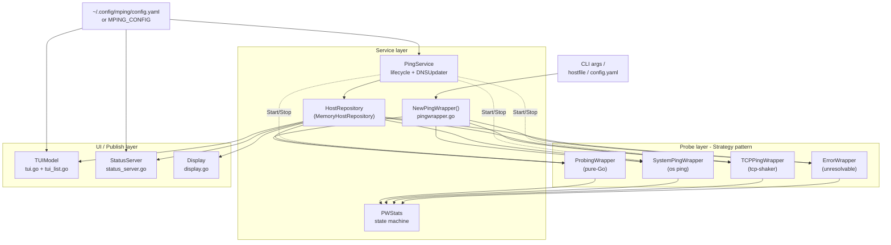
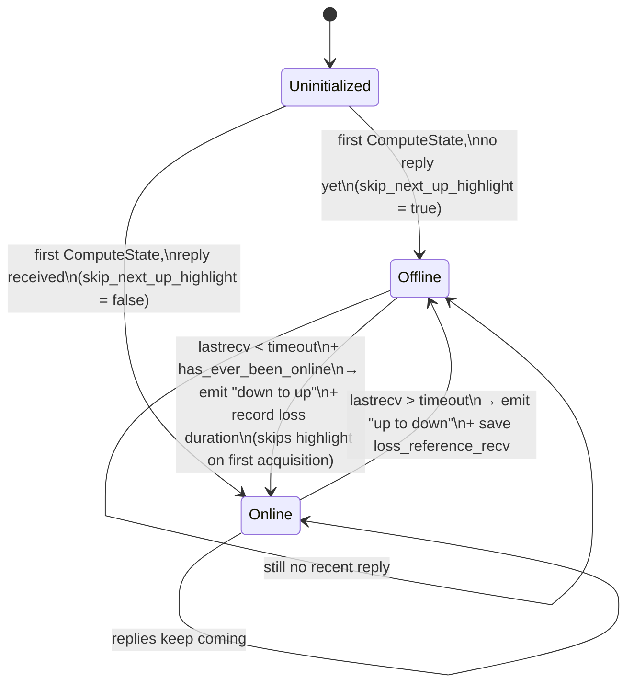
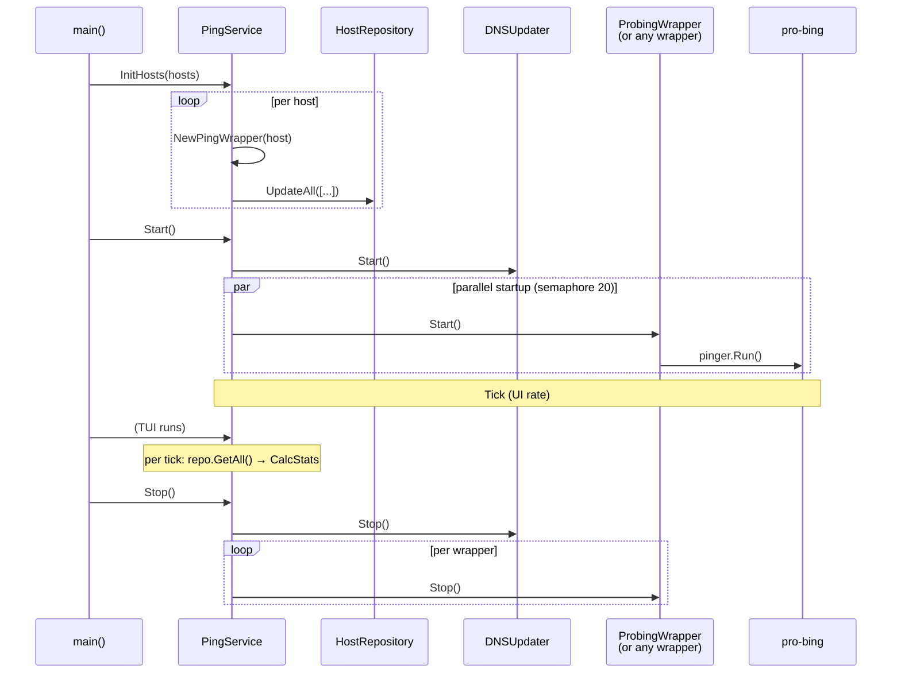
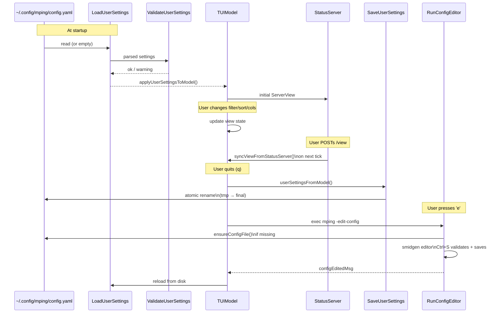

# Architecture

This document describes the internal architecture of MultiPingTUI. It is
written for developers extending the codebase, not for end users. For
usage, see [`README.md`](../README.md).

---

## 1. Bird's-eye view

MultiPingTUI is a single-package Go program (`main`). It monitors a
variable list of network targets, computes their up/down state, and
publishes that state to one of three sinks:

1. The interactive **TUI** (bubbletea), default.
2. The **HTTP status server** (started by the TUI, or standalone via
   `-webserver`).
3. The **legacy display** (`pterm`, via `-notui`).

The architecture has three layers:



Key properties of this design:

- Wrappers are **pure**: they know nothing about the repository, the UI,
  or other hosts. The service is the only owner of their lifecycle.
- `PingService` is **the** entry point for starting and replacing hosts.
  Everything else consumes state via snapshots (`PWStats` value copies).
- The three sinks share one `HostRepository`. They never communicate with
  each other directly except through `ServerView` patches that the
  TUI applies via `syncViewFromStatusServer()`.

---

## 2. The `PingWrapperInterface` contract

Every probe (ICMP, system ping, TCP, error) implements:

```go
type PingWrapperInterface interface {
    Start()
    Stop()
    Host() string
    CalcStats(timeoutThreshold int64) PWStats
    Stats() *PWStats
    SetHostRepr(string)
}
```

| Method | Concurrency contract |
|---|---|
| `Start()` | Idempotent? No — must be called once. Safe to call before `Stop`. Spawns goroutines; the wrapper holds `sync.RWMutex` from then on. |
| `Stop()` | **Idempotent** (must use `sync.Once`). Cancels goroutines and waits via context or `chan struct{}`. Returns quickly (no blocking I/O). |
| `Host()` | Lock-free, returns the display string `"name (ip)"` or `"tcp://name:port (ip:port)"`. |
| `CalcStats(timeout)` | Holds the write lock; calls `PWStats.ComputeState(timeout)`; returns a **value copy** of `PWStats`. |
| `Stats()` | Holds the read lock; returns a **value copy on the heap** (`*PWStats` to satisfy the interface, but the data is cloned). |
| `SetHostRepr(string)` | Holds the write lock; mutates `PWStats.hrepr`. Used by `DNSUpdater`. |

### Why value copies

`PWStats` is small (≈120 bytes including 8 int64 fields and a few
strings). Copying it under lock costs almost nothing compared to
`sync.RWMutex` contention on a /24 subnet, and it eliminates a whole
class of "I'm reading the field while another goroutine writes it" races.
Every consumer of `PWStats` (TUI list, dashboard, web JSON) therefore sees
a frozen snapshot for the duration of one frame.

### Strategy selection

`NewPingWrapper(host string, options Options, tw *TransitionWriter)` in
`pingwrapper.go` parses the host string with the regex

```text
^(tcp|ip)([46])?://(\[?.+?\]?)(?::(\d+))?$
```

and dispatches:

| Match | Wrapper | Notes |
|---|---|---|
| `tcp://...` | `TCPPingWrapper` | Port required. `tcp://[::1]:22` for IPv6. |
| `ip://...` + `-s` | `SystemPingWrapper` | Parses system `ping` output. |
| `ip://...` | `ProbingWrapper` | Pure-Go ICMP. |
| (any other error) | `ErrorWrapper` | Reports via `PWStats.error_message`, never blocks startup. |

---

## 3. The state machine (`PWStats`)

`PWStats` is the single source of truth for "is this host up?". Its state
is recomputed by `ComputeState(timeout_threshold int64)`, called by every
wrapper's `CalcStats()`.



Key invariants enforced by the test in `pwstats_test.go`:

1. **First observation never highlights** as a transition (`skip_next_up_highlight`).
2. **No bogus loss on first acquisition**: when starting offline and
   receiving the first reply, `last_loss_nano` and `last_loss_duration`
   stay zero.
3. **Loss duration is anchored on the last good reply**, not on the
   recovery time: `loss_reference_recv` is captured at the up→down edge
   and cleared on the down→up edge.
4. **`uptime_nano` accumulates only while `state == true`**, computed
   by `OnlineUptime(now int64)`.

The transition log is written inside `ComputeState` as a single
`bufio.Writer.WriteString` to `TransitionWriter`. JSON shape is fixed
(see [`docs/API.md`](./API.md) — Transition log section).

---

## 4. Lifecycle: PingService and HostRepository

`PingService` is a thin orchestrator:

```go
type PingService struct {
    repo             HostRepository
    options          Options
    transitionWriter *TransitionWriter
    dnsUpdater       *DNSUpdater
    wrapperFactory   func(host string, options Options, tw *TransitionWriter) PingWrapperInterface
    mu               sync.Mutex
    running          bool
}
```

The lifecycle is:



### Concurrency limits

- **Startup**: `startWrappers` in `ping_service.go` launches each
  `wrapper.Start()` in its own goroutine, capped by a `chan struct{}`
  of capacity 20. After every 10 wrappers (and only between host 10 and
  `len-1`), it sleeps 1 ms to avoid ARP / ICMP storms on /24.
- **DNS**: `DNSUpdater.performDNSUpdates` uses a parallel semaphore of 20.
  It runs only for hosts that are **online** (state == true && no error)
  and skips those already in the positive cache.
- **Replace hosts**: `PingService.ReplaceHosts(hosts)` is the supported
  way to swap the live set (used by the in-terminal config editor).
  It stops the old wrappers, atomically updates the repo, restarts DNS,
  and starts the new wrappers in parallel.

### DNS updater cadence

```mermaid
flowchart LR
    Start[Service.Start] --> Init[initialTimer 3s]
    Init --> Tick[ticker 60s]
    Tick --> Update[performDNSUpdates]
    Update -->|only online hosts| Lookup[reverse-DNS\n500ms timeout]
    Lookup --> Cache[Update dnsCache\n(positive 1h, negative 5m)]
    Update -->|stale wrappers| Restore[restore cached name\nif display looks like IP]
```

---

## 5. The three sinks

### 5.1 TUI

The TUI is bubbletea. The model is `TUIModel`:

```mermaid
flowchart LR
    Tick[tickMsg\n100ms] --> Cache[updateStatsCache]
    Cache --> Repo[repo.GetAll]
    Repo --> Calc[wrapper.CalcStats]
    Calc --> Map[(statsCache\nmap[string]PWStats)]
    Map --> View[View]
    View --> Filter[getFilteredWrappers]
    Filter --> List[renderListView]
    View -.View mode.-> Detail[renderDetailView]
    View -.View mode.-> Dash[renderDashboardView]
```

Three performance-critical rules:

1. **`updateStatsCache()` runs once per tick, not once per render.** The
   first `View()` call must never block on `CalcStats()` for 254 hosts.
2. **Cache miss returns an empty `PWStats`, not a blocking `CalcStats`.**
3. **`hostList.cachedWrappers` invalidates on filter / sort / view
   change** so we don't re-filter+sort on every frame.

View modes:

| Mode | Triggered by | Content |
|---|---|---|
| `viewList` | default, `Esc` | Filtered / sorted host table, optional subnet grouping |
| `viewDetails` | `Enter` on a selected host | Detail view + traceroute output |
| `viewDashboard` | `d` | Aggregated stats (totals, RTT distribution, top offline / top RTT, recent transitions) |

### 5.2 Status server

`StatusServer` is a `net/http` server bound to `127.0.0.1:<port>`. It
is started either by `RunTUI` (alongside the TUI) or by `main` directly
in `-webserver` mode.

Endpoints and contracts are documented in [`docs/API.md`](./API.md).
The architectural key points are:

- `viewMu` protects `ServerView`. The TUI reads `statusServer.View()`
  on every `Update()` to apply changes made via the web UI
  (`syncViewFromStatusServer`).
- `traceMu` protects `traces`, capped at 256 entries (FIFO prune).
  `traceSem` (capacity 2) prevents more than two simultaneous traceroutes.
- All write handlers use `http.MaxBytesReader` to cap the request body.
- All responses set `Cache-Control: no-store` and `Connection: close`.
  Keep-alives are disabled to prevent goroutine leaks.

### 5.3 Legacy display

`Display` (in `display.go`) uses `pterm.AreaPrinter` to redraw a
plain-text table every 100 ms. It is enabled by `-notui` and supports
the same `-only-online` / `-only-offline` filter via `SetFilter()`. It
has no write-back path to the config.

---

## 6. Configuration round-trip



The YAML parser is a deliberately tiny subset in `user_settings.go`.
Comments (`#`), keys without quotes, flow-style lists (`[1, 2, 3]`),
and the special `hosts: []` / `view: {}` markers are all handled inline
to keep the binary dependency-free.

---

## 7. Mode matrix

| `-flags` | TUI | Web | Legacy display | Once | Hosts file | Log |
|---|---|---|---|---|---|---|
| (none) | ✓ | ✓ | | | | optional |
| `-q` | ✓ (hidden) | ✓ | | | | optional |
| `-webserver` | | ✓ | | | | optional |
| `-notui` | | | ✓ | | | optional |
| `-once` | | | | ✓ | | optional |
| `-once -only-online` | | | | ✓ (filter) | | optional |
| `-hostfile FILE` | ✓ | ✓ | ✓ | ✓ | ✓ | optional |
| `-edit-config` | (exits after edit) | | | | | |

---

## 8. Performance & scaling

| Concern | Mitigation | Where |
|---|---|---|
| DNS lookups on /24 | 500 ms per lookup, parallel 20, 1 h positive / 5 min negative cache | `dns_updater.go` |
| ICMP storm on /24 startup | Semaphore 20 + 1 ms / 10 hosts | `ping_service.go` `startWrappers` |
| TUI hang on first render | `updateStatsCache` per tick + cache-miss returns empty | `tui.go` `getCachedStats` |
| CPU on idle /24 | Adaptive interval (10 s) for never-online hosts | `PWStats.GetPingInterval` |
| Goroutine leak in webserver | Keep-alives disabled, low idle timeout | `status_server.go` |
| Memory pressure on huge lists | Viewport renders only `height` rows, scroll-offset adjusts | `tui_list.go` `renderListView` |
| File-descriptor exhaustion in once-mode | Worker pool cap = 100 | `subnet.go` `onceWorkerLimit` |
| Wildcard CIDR | `ErrCIDRTooLarge` guard (>65 536 hosts) | `subnet.go` `ExpandCIDR` |

---

## 9. Extension points

- **New probe** → implement `PingWrapperInterface`, add a regex match or
  new scheme to `NewPingWrapper`.
- **New view mode** → add to `tuiViewMode`, handle in `TUIModel.Update`'s
  `key.Matches` switch, render in `TUIModel.View`.
- **New filter / sort** → add enum value, cycle, label, and validation
  function; wire into `applyFilterAndSort` and `sortWrappersSliceGeneric`.
- **New HTTP endpoint** → register in `StartStatusServer`'s `mux`,
  guard method via `allowMethods`, document in `docs/API.md`.
- **New config field** → add field to `UserViewSettings`, extend
  parser/marshaller, validate in `ValidateUserSettings`, apply in
  `applyUserSettingsToModel`/`userSettingsFromModel`.
- **New state derivation** → never mutate `PWStats` fields outside
  `ComputeState`; instead, derive on read.

---

## 10. File index

| File | Lines | Role |
|---|---:|---|
| `main.go` | 425 | Entry point, CLI parsing, mode orchestration |
| `config.go` | 65 | Flag definitions |
| `pingwrapper.go` | 107 | Strategy factory + regex |
| `pinger_probing.go` | 166 | Pure-Go ICMP |
| `pinger_system.go` | 179 | OS `ping` subprocess |
| `pinger_tcp.go` | 157 | TCP probe (unix) |
| `pinger_tcp_win.go` | 138 | TCP probe (Windows, full handshake) |
| `error_wrapper.go` | 54 | Safe placeholder for unresolvable hosts |
| `pwstats.go` | 238 | State machine |
| `ping_service.go` | 152 | Lifecycle, parallel startup |
| `ping_service_test.go` | 212 | Lifecycle unit tests |
| `repository.go` | 38 | In-memory host store |
| `repository_test.go` | 79 | Repository unit tests |
| `transitionwriter.go` | 63 | Buffered JSON log writer |
| `dns_updater.go` | 204 | Periodic reverse DNS |
| `host_display.go` | 120 | One-shot reverse DNS |
| `subnet.go` | 275 | CIDR expansion + once-mode |
| `display.go` | 108 | Legacy `pterm` display |
| `user_settings.go` | 460 | Config persistence + tiny YAML parser |
| `config_editor_smidgen.go` | 87 | Embedded config editor |
| `traceroute.go` | 92 | `traceroute`/`tracepath`/`tracert` wrapper |
| `selfupdate.go` | 91 | GitHub release self-update |
| `tui.go` | 1488 | TUI model, lifecycle, render |
| `tui_list.go` | 789 | List rendering, filter, sort, grouping |
| `tui_components.go` | 171 | Header / Footer / HostListModel |
| `tui_utils.go` | 95 | Cycles, hidden-hosts clone, IP-key |
| `status_server.go` | 2254 | HTTP server, dashboard, HTML |
| `lifecycle_regression_test.go` | 339 | Cross-cutting regression suite |