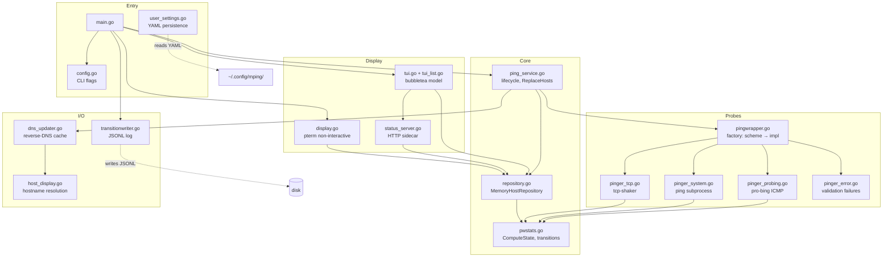
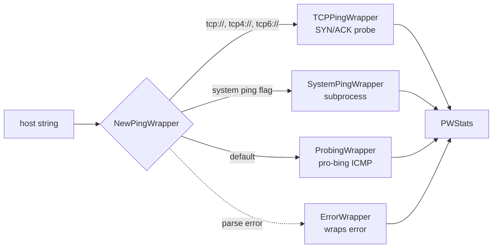
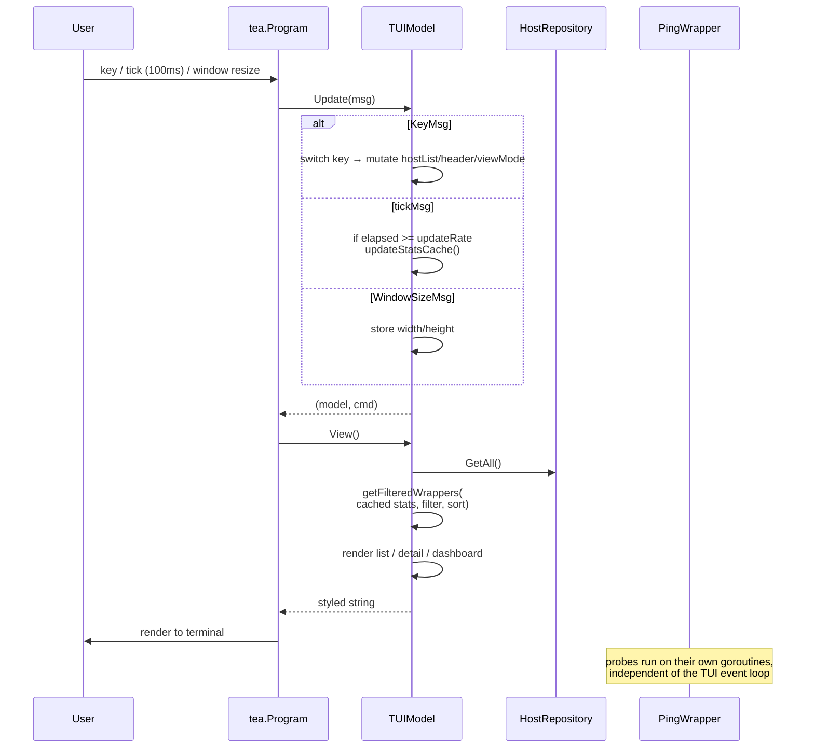
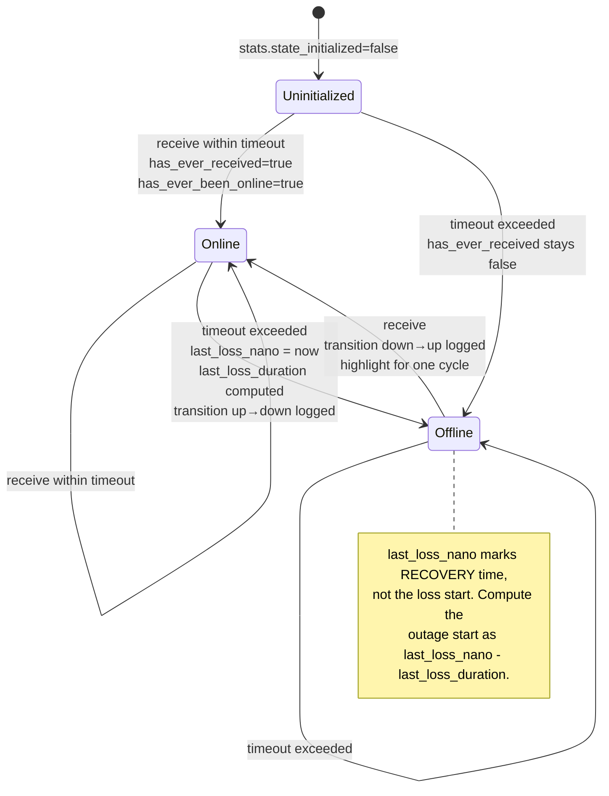

# Architecture

Module map, data flow, and key state machines. Implementation detail belongs in source comments — this doc is for orientation.

## Module Overview



## Three Ping Backends (Strategy Pattern)

`PingWrapperInterface` is the contract. `NewPingWrapper()` selects the implementation by URL scheme.



Add a new backend by implementing `PingWrapperInterface` and adding a branch to the factory. Do not add interfaces — the existing one already has three implementations.

## TUI Update Loop

The TUI is an Elm/Bubbletea model. State flows one direction: `Msg → Update → Model → View`.



The probes run independently — they update `PWStats` (mutex-protected) and the TUI just reads the cache. There is no callback from probes into the TUI; the tick is the only sync point.

## PWStats State Machine

`ComputeState(timeout_ns)` is called once per ping result. It tracks three booleans and two timestamps.



The "highlight for one cycle" on down→up is implemented via `skip_next_up_highlight` to suppress double-firing when state flips rapidly.

## ViewState Propagation

The TUI and the HTTP server share the same source data. The HTTP server gets it via `StatsProvider(PingWrapperInterface) PWStats` — a function injected at startup. There is no shared mutable state between TUI and HTTP server; both read the `HostRepository` independently.

```
Wrapper → CalcStats → PWStats (per wrapper, mutex-protected)
                       ↓
            ┌──────────┴──────────┐
            ↓                     ↓
   TUI: statsCache            HTTP: StatsProvider func
   (refreshed per tick)       (called per request)
```

This means the HTTP view is always one tick behind the TUI at most. That's intentional — avoids blocking the TUI on a slow client.

## Repository Contract

`HostRepository` has exactly two methods: `GetAll()` returns a copy, `UpdateAll([]PingWrapperInterface)` replaces. The copy semantics in `GetAll()` are load-bearing — readers never see torn writes during `UpdateAll`. Do not add methods that return the underlying slice.

## DNS Resolution

`DNSUpdater` runs a background goroutine that periodically refreshes reverse-DNS for all hosts. It uses `hostDisplayName()` with a 500ms per-lookup timeout. `-no-dns` disables it entirely.

The TUI does not block on DNS. Hostnames may show as the IP for the first few hundred ms after startup; they fill in asynchronously. This is by design — sequential DNS would block large-subnet startup for minutes.

## Adaptive Ping Intervals

For subnets, hosts that have never been online are pinged every 10 seconds. Once a host replies, the interval drops to 1 second. The switch is driven by `PWStats.has_ever_been_online` and applied via `pinger.Interval` (pro-bing) or a ticker reset (TCP).

Auto-enabled when CIDR notation is detected in arguments. `-adaptive` forces it on.

## Concurrency Invariants

These must hold. Violations will manifest as data races (caught by `-race`) or stale UI.

- `MemoryHostRepository.mu` protects `wrappers` slice.
- `PWStats.mu` protects all PWStats fields.
- `TransitionWriter.mu` protects the buffered channel.
- `TUIModel.statsCacheMu` protects `statsCache` (separate from `repo.mu`).
- `StatusServer.viewMu` protects `ServerView`.
- `StatusServer.traceSem` is a counting semaphore (4 slots) for concurrent traceroutes.

No other shared state. New shared state needs a mutex named for the field it protects.