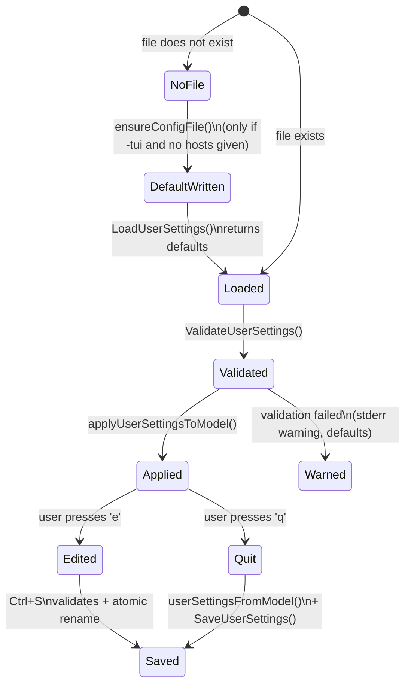

# Configuration

This document describes the YAML config file used by `mping`, its schema,
where it lives, and when it is read and written.

---

## 1. File location & override

| Default | Override | Notes |
|---|---|---|
| `~/.config/mping/config.yaml` | `MPING_CONFIG=/some/path/config.yaml` | The directory is created if missing. File mode 0600. |

The override is read by `userSettingsPath()` in `user_settings.go`.

If the file does not exist on startup and no hosts were given on the
command line, `ensureConfigFile()` writes a commented default config
(see [`DefaultUserSettings`](#default-settings)).

---

## 2. Schema

```yaml
hosts:
  - "localhost"
  - "github.com"
  - "tcp://example.com:443"
  - "192.168.1.0/24"

view:
  filter: 1                # 0..3 (see Filter enum)
  sort: 4                  # 0..4 (see Sort enum)
  rate: 1                  # 0..3 (see Rate enum)
  group_by_subnet: true    # bool
  cols: [1, 2, 3, 4, 5, 6] # subset of 1..6, no duplicates
  hidden:
    "192.168.1.55": true   # key = host string; value must be true
```

### 2.1 `hosts`

A list of host strings. Each entry supports:

| Form | Example |
|---|---|
| Plain hostname / IP | `github.com`, `8.8.8.8` |
| ICMP scheme | `ip://example.com`, `ip4://example.com`, `ip6://example.com` |
| TCP scheme | `tcp://example.com:443`, `tcp://[::1]:22`, `tcp4://…`, `tcp6://…` |
| CIDR (expands to all usable IPs) | `192.168.1.0/24` |

Lines starting with `#` (outside quoted values) and empty lines are
ignored when reading via `-hostfile`. In the YAML config, comments
inside quotes (`"host#one"`) are preserved as part of the host string.

Maximum CIDR expansion: **65 536 hosts**. Anything larger (e.g.
`10.0.0.0/8`) errors out with `ErrCIDRTooLarge`.

### 2.2 `view.filter`

| Value | Name | Meaning |
|---:|---|---|
| 0 | All | Show every host |
| 1 | Smart (default) | Show hosts that are online **or** have ever been online |
| 2 | Online | Show only currently-online hosts |
| 3 | Offline | Show only currently-offline hosts |

Cycled in the TUI with `f`. The cycle order is **Smart → Online →
Offline → All**.

### 2.3 `view.sort`

| Value | Name | Behavior |
|---:|---|---|
| 0 | Name | Alphabetical by reverse-DNS name; offline hosts at end |
| 1 | Status | Online first, then alphabetical |
| 2 | RTT | Online hosts by RTT ascending; offline at end |
| 3 | Last Seen | Offline first by last-loss time; stable online hosts at end by name |
| 4 | IP (default) | Numeric IP comparison (IPv4 then IPv6), fallback to host string |

Cycled with `s`.

### 2.4 `view.rate`

| Value | Interval |
|---:|---|
| 0 | 100 ms (very chatty) |
| 1 | 1 s (default) |
| 2 | 5 s |
| 3 | 30 s |

Cycled with `r`. Note: the stats-cache update rate is throttled, but the
**UI ticker always runs at 100 ms** so `View()` re-renders smoothly.

### 2.5 `view.cols`

A subset of `[1..6]` with no duplicates. Order does not affect the
rendered order; it only affects whether a column is visible.

| # | Column |
|---:|---|
| 1 | Status (St) |
| 2 | Name |
| 3 | IP |
| 4 | RTT |
| 5 | Last Reply |
| 6 | Last Loss |

Toggled in the TUI with `1`–`6`. If your terminal is too narrow to fit
all visible columns, the list view first shrinks each column down to
its minimum width, then auto-hides columns from right to left (excluding
1 and 2) until it fits.

### 2.6 `view.hidden`

Map of `host-string → true`. Hosts with `value = true` are excluded
from the list view and from the web dashboard. Anything other than
`true` is ignored (allows future expansion without breaking configs).

Set via `del` in the TUI; cleared for everyone via `ins`.

### 2.7 `view.group_by_subnet`

When `true` and the host list contains at least one CIDR, the list view
inserts a colored subnet header above each group. Toggled with `g`.

---

## 3. Default settings

If `MPING_CONFIG` (or the default path) doesn't exist, `mping` writes
this file on first run:

```yaml
# mping config
#
# This file is automatically loaded on startup and saved on exit.
# Override the location via the environment variable: MPING_CONFIG
#
# hosts:
#   - A list of targets to probe.
#   - Supports: hostnames, IPs, CIDR (e.g. "192.168.1.0/24"), and tcp://host:port.
#
# view:
#   - Initial TUI/Web view state.
#   filter:
#     0=All, 1=Smart (online or ever-seen), 2=Online, 3=Offline
#   sort:
#     0=Name, 1=Status, 2=RTT, 3=Last Seen, 4=IP
#   rate:
#     0=100ms, 1=1s, 2=5s, 3=30s
#   cols:
#     Visible columns (1..6): 1=Status, 2=Name, 3=IP, 4=RTT, 5=Last Reply, 6=Last Loss
#   hidden:
#     Host key -> true to hide it in the list.

hosts:
  - "localhost"
  - "www.github.com"

view:
  filter: 1
  sort: 4
  rate: 1
  group_by_subnet: true
  cols: [1, 2, 3, 4, 5, 6]
  hidden: {}
```

---

## 4. Lifecycle



### 4.1 Atomic write

`SaveUserSettings` writes to `<path>.tmp` then `os.Rename`s onto the
target. This avoids half-written config files if the process is killed
mid-save.

### 4.2 When state is persisted

| Trigger | Persisted? |
|---|---|
| TUI quits with `q` / `Ctrl+C` | ✓ — full `userSettingsFromModel` |
| `-once` mode | ✗ |
| `-notui` mode | ✗ |
| `-webserver` mode | ✓ — final `ServerView` on SIGINT/SIGTERM |
| `-edit-config` exit (no save) | ✗ |

---

## 5. In-terminal config editor

Pressing `e` in the TUI launches a child `mping -edit-config` process.
The child:

1. Calls `ensureConfigFile(path)` (so a fresh install still opens
   something).
2. Renders the file with `smidgen` (monokai syntax highlighting).
3. Captures `Ctrl+S`:
   - Runs `parseUserSettings(buffer.Bytes())` + `ValidateUserSettings`.
   - On error: status bar shows the error, file is **not** written.
   - On success: `os.WriteFile(path, buffer.Bytes(), 0o600)`.
4. `Esc` closes without saving.

When the editor exits, the parent TUI receives a `configEditedMsg`,
reloads the file via `LoadUserSettings`, and calls
`applyUserSettingsToModel`. If `hosts` changed,
`PingService.ReplaceHosts` swaps the live set.

---

## 6. Validation rules

`ValidateUserSettings` rejects:

- Any host string that is empty after trim.
- `view.filter` outside `0..3`.
- `view.sort` outside `0..4`.
- `view.rate` outside `0..3`.
- Any `view.cols[i]` outside `1..6`.
- Duplicate `view.cols` values.
- (Empty-string keys in `view.hidden` are ignored for forward
  compatibility with older configs.)

If validation fails at startup, `mping` writes a warning to stderr and
proceeds with `DefaultUserSettings()`.

---

## 7. Environment variables

| Variable | Effect |
|---|---|
| `MPING_CONFIG` | Path to the YAML config file. Overrides the `~/.config/mping/config.yaml` default. |
| `LANG=C` | `SystemPingWrapper` sets this on the spawned `ping` process so output is parseable in any locale. |

---

## 8. Examples

### Minimal

```yaml
hosts: ["localhost"]
view: { filter: 0, sort: 4, rate: 1, cols: [1, 2, 3], hidden: {} }
```

### Production monitoring

```yaml
hosts:
  - "router.lan"
  - "nas.lan"
  - "8.8.8.8"
  - "1.1.1.1"
  - "tcp://grafana.lan:3000"

view:
  filter: 2        # Online only — focus on uptime
  sort: 4          # IP order
  rate: 2          # 5s — light on CPU
  group_by_subnet: false
  cols: [1, 2, 3, 4, 5]
  hidden: {}
```

### Subnet sweep

```yaml
hosts:
  - "192.168.1.0/24"
view:
  filter: 1        # Smart — hides dead IPs by default
  sort: 1          # Status — online first
  rate: 1
  cols: [1, 2, 3, 4]
  hidden: {}
  group_by_subnet: true
```

### Watch only known-down hosts

```yaml
hosts:
  - "router.lan"
  - "printer.lan"
  - "nas.lan"
view:
  filter: 3        # Offline only
  sort: 3          # Last Seen — most-recent-loss first
  rate: 1
  cols: [1, 2, 3, 5, 6]
  hidden: {}
```

---

## 9. Versioning

The schema is currently unversioned. Backward-compatible additions (new
optional keys under `view`, new enum values) are permitted without a
schema version bump. A breaking change (renaming keys, changing value
semantics) will bump the file format to `v2:` and document the
migration here.